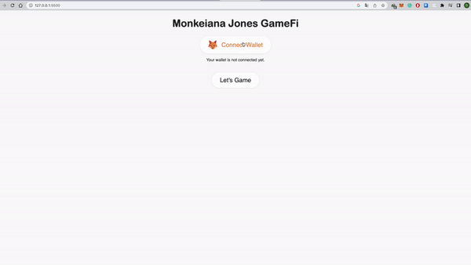
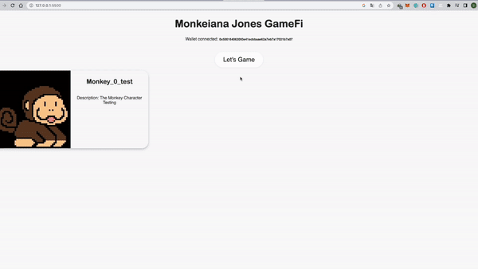
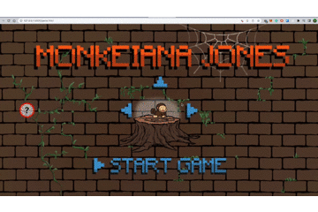

# Enertime Web3 - Monkeiana Jones GameFi Demo


## Prototype Structure

```
├── index.html --> Entry page
├── game.html --> Game page
├── script
│   ├── Game.js --> Game logic
│   ├── connectWallet.js --> Metamask connection
│   ├── nftCard.js --> List NFT characters that user owns
│   └── winCoin.js --> Transfer the earned fungible token to user's wallet
└── style.css
```

## Prerequisite

- Install Metamask for connecting to Web 3.0
  - https://metamask.io
- You can choose to play the game by directly accessing to "/game.html" after initializing localhost environment without connecting Metamask, but the fungible token you earned during the game will not be transferred 

## Testing Guideline

- You need to switch the network to Ethereum Goerli Testnet, also need to have some Testnet Ether (Goerli ETH)
  - Places to get testnet Goerli ETH
    - https://goerlifaucet.com
    - https://goerli-faucet.pk910.de
    - https://goerlifaucet.org
- You can use "Go Live" function from VS Code for local host initialization to access the game
  - https://code.visualstudio.com

- You need to connect Metamask first, and website will display the Character NFT that you own

  

  

- You can press "Let's Game" button to play the game after character selection

  

  

- The fungible token that you earned will be transferred to your Metamask (Goerli Testnet) after each round of gameplay

  


